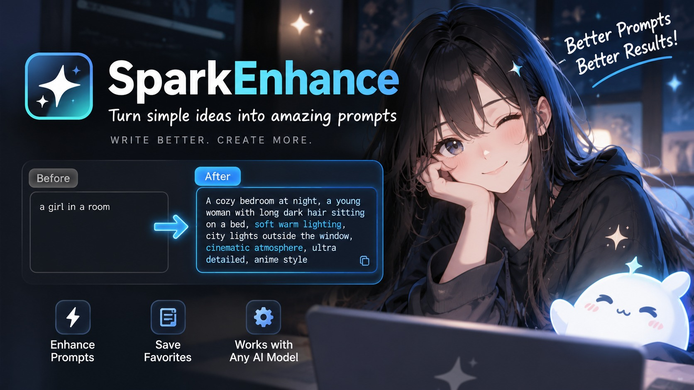

# SparkEnhance



> Hover-enhance any text in any app into a numbered agent brief.
> Tray app. **Ctrl+Shift+E**. MiniMax-M3 via GMI Cloud.
> Cross-platform: **Windows 10/11**, **macOS 11+**, **Linux (X11 / Wayland)**.


## What it is

A standalone desktop app that turns messy text into a structured,
agent-ready brief using **MiniMax-M3** on GMI Cloud. Sits in the system
tray, listens for a global hotkey, reads the current selection, and
writes the enhanced version back to the clipboard.

It runs the same on every desktop OS — same binary shape, same hotkey,
same UX. The only platform-specific code is a 5-line Win32 `SetWindowRgn`
call that keeps Windows from drawing a rectangular DWM border around the
rounded pill.

## Demo

**Input (messy draft):**
> fix the login flow

**Output (M3 brief):**
> **Goal:** Ship a working login flow that authenticates users against
> the existing `users` table and issues a session JWT.
>
> 1. Add a `POST /api/v1/login` endpoint that validates user credentials
> 2. Hash incoming passwords with bcrypt and compare against the
>    `password_hash` column
> 3. Issue a JWT in the response when credentials are valid
> 4. Return `401` with a clear error message when credentials are wrong
> 5. Write 3 pytest cases covering happy path, bad password, missing user
> 6. Add rate limiting (5 attempts per minute per IP)
> 7. Update the OpenAPI spec with the new endpoint and example requests

## Cross-platform story

| OS | Bar window | Rounded corners | Hotkey | Clipboard |
|---|---|---|---|---|
| **Windows 10/11** | WebView2 | `SetWindowRgn` + CSS | `RegisterHotKey` (Win32) | Win32 `OpenClipboard` |
| **macOS 11+** | WKWebView | AppKit `NSWindow.cornerRadius` (built-in) | `NSEvent.addGlobalMonitor` | `NSPasteboard` |
| **Linux (X11)** | WebKitGTK | CSS only (no extra work) | X server key grab | `xclip` / `xsel` |
| **Linux (Wayland)** | WebKitGTK | CSS only | `org.freedesktop.portal.GlobalShortcuts` | portal D-Bus |

The Wails v3 runtime wraps the platform APIs so the Go source stays the
same across OSes. Windows-specific code is guarded by `//go:build windows`
and compiled out on macOS / Linux (becoming a no-op).

## Install

### Pre-built binary

Download `sparkenhance.exe` (Windows), `SparkEnhance.app` (macOS), or
`sparkenhance` (Linux) from the [latest release](../../releases).

| OS | Prerequisite |
|---|---|
| Windows | WebView2 (preinstalled on Win 10 since 2021 and on Win 11) |
| macOS | macOS 11+ (Big Sur) |
| Linux | WebKit2GTK 2.40+ (Ubuntu 22.04 / Debian 12) or `webkit2gtk-4.1` |

> Linux: install `webkit2gtk-4.1` and `gtk-3` via your package manager
> (`apt install libwebkit2gtk-4.1-dev build-essential`).

### From source

**Requirements:** Go 1.26+, Wails v3 CLI, Node.js 18+.

```bash
git clone https://github.com/tuancookiez-hub/SparkEnhance.git
cd SparkEnhance

# Install Wails v3 CLI
go install github.com/wailsapp/wails/v3/cmd/wails3@latest

# Build for your current platform
wails3 build        # uses the included Taskfile.yml
```

> **Note:** SparkEnhance requires CGo on macOS (AppKit) and Linux (GTK/webkit2gtk).
> Windows builds are pure Go (`CGO_ENABLED=0`). You can cross-compile the
> Windows binary from any OS; macOS and Linux builds must be run on their
> respective OSes.

Output: `build/bin/sparkenhance.exe` (Windows) or
`build/bin/SparkEnhance.app` (macOS) or `build/bin/sparkenhance` (Linux).

### Get a GMI Cloud API key

1. Create a free account at <https://console.gmicloud.ai>
2. **API Keys** → create a new key
3. Paste it into SparkEnhance on first launch, **or** set `MINIMAX_API_KEY`
4. Default model: **MiniMax-M3** (any other GMI model works)

## Configuration

SparkEnhance reads from a per-OS config file:

| OS | Path |
|---|---|
| Windows | `%APPDATA%\SparkEnhance\config.json` |
| macOS | `~/Library/Application Support/SparkEnhance/config.json` |
| Linux | `~/.config/SparkEnhance/config.json` |

The file is **gitignored** so it never gets committed.

```json
{
  "apiKey": "sk-…",
  "baseURL": "https://api.gmi-serving.com/v1",
  "model": "MiniMaxAI/MiniMax-M3",
  "hotkey": "ctrl+shift+e",
  "autoPaste": false
}
```

For CI / shared environments, set `MINIMAX_API_KEY` instead — the app
falls back to the env var when the config file is missing.

## Hotkey

Default: **`Ctrl+Shift+E`** (`CmdOrCtrl+Shift+E` on macOS).

If the accelerator can't be claimed on Linux Wayland, the desktop
session's global-shortcut portal will ask you to approve the binding.
If it's already in use by another app, SparkEnhance will fall back to a
different combination on the next launch.

## Architecture

```
┌──────────────────────────────────────────────────┐
│  Floating bar — 600×56 frameless window            │
│  - WebView2 / WKWebView / WebKit2GTK               │
│  - Opaque pill bg: #181a26                        │
│  - macOS: native cornerRadius (built-in)           │
│  - Win10/11: SetWindowRgn clips to 15px rect      │
│  - Linux: CSS border-radius (no extra work)       │
│  - States: idle / loading / result / error        │
│  - Auto-hide after 30s of inactivity              │
└────────────────┬─────────────────────────────────┘
                 │ Wails events (TypeScript ⇄ Go)
┌────────────────▼─────────────────────────────────┐
│  Go backend (main.go)                            │
│  - runEnhance:   read selection → call GMI → emit│
│  - showBar / dismissBar: position + clip + show  │
│  - GlobalShortcut.Register: hotkey (cross-OS)   │
│  - Auto-hide loop: 30s timer, reset on activity   │
└────────────────┬─────────────────────────────────┘
                 │
┌────────────────▼─────────────────────────────────┐
│  internal/ (no secrets stored)                   │
│  - config:     cross-platform config path + JSON │
│  - enhance:    MiniMax-M3 chat-completions call  │
│  - platform:   Win32 SetWindowRgn, clipboard,    │
│                monitor detection (build-tagged)   │
│  - placement:  bar x/y math                      │
└──────────────────────────────────────────────────┘
```

## Files

| Path | Purpose |
|---|---|
| `main.go` | Wails v3 bootstrap, hotkey, bar lifecycle |
| `Taskfile.yml` | Cross-platform build tasks (`task build`, `task dev`) |
| `build/config.yml` | Wails v3 product metadata + dev-mode task chain |
| `build/{windows,darwin,linux,ios,android}/Taskfile.yml` | Platform-specific build tasks |
| `internal/config/` | JSON config at the per-OS `DefaultDir()` path |
| `internal/enhance/` | MiniMax-M3 chat-completions client + system prompt |
| `internal/platform/` | Cross-platform stubs + Windows-only `SetWindowRgn`, clipboard, monitor detection |
| `internal/placement/` | Bar x/y math (centered on cursor's monitor) |
| `frontend/src/App.tsx` | React root — bar + settings screens |
| `frontend/src/main.tsx` | Router — `/settings` vs `/` |
| `frontend/src/style.css` | Pill styling (matches Windows region; pure CSS elsewhere) |
| `build/windows/icon.ico` | 6-resolution app icon |
| `assets/hero-banner.jpg` | README hero banner |

## Security & privacy

- **API key** is stored locally on disk and never leaves the machine
  except as a Bearer token to the configured `baseURL`.
- **Selection text** is sent to the configured `baseURL` only when the
  hotkey fires — never logged, never persisted to disk.
- **No telemetry, no analytics, no phone-home.**
- **`config.json` is gitignored** — fork-safe out of the box.

## Tests

```bash
go test ./...
# internal/enhance:  cleaner, scorer, mocked GMI round-trip
# internal/platform: window region, monitor detection
# internal/placement: bar position bounds
```

## Compared to the Desktop plugin

| | Hermes Desktop plugin | SparkEnhance (this) |
|---|---|---|
| Where it runs | Inside Hermes Desktop | Standalone desktop app |
| Where it works | Hermes composer | Any text in any app |
| Activation | Click sparkle | `Ctrl+Shift+E` (global) |
| Output | Replaces composer draft | Clipboard + auto-paste |
| Binary | Bundled with Desktop | 14 MB single .exe / .app / ELF |
| UI tech | React (WebView2) inside Hermes | React standalone (WebView2 / WKWebView / WebKit2GTK) |
| Platforms | Windows only | Windows, macOS, Linux |

The rewrite logic — system prompt + cleaner — is **ported 1:1** from the
plugin's `prompts.py`.

## Hackathon submission

- **Track:** 1 (Reasoning)
- **Models used:** MiniMax-M3 (and 3.5-Speculative)
- **GMI endpoint:** `https://api.gmi-serving.com/v1/chat/completions`
- **Public repo:** <https://github.com/tuancookiez-hub/SparkEnhance>

## License

MIT — see [LICENSE](LICENSE).
